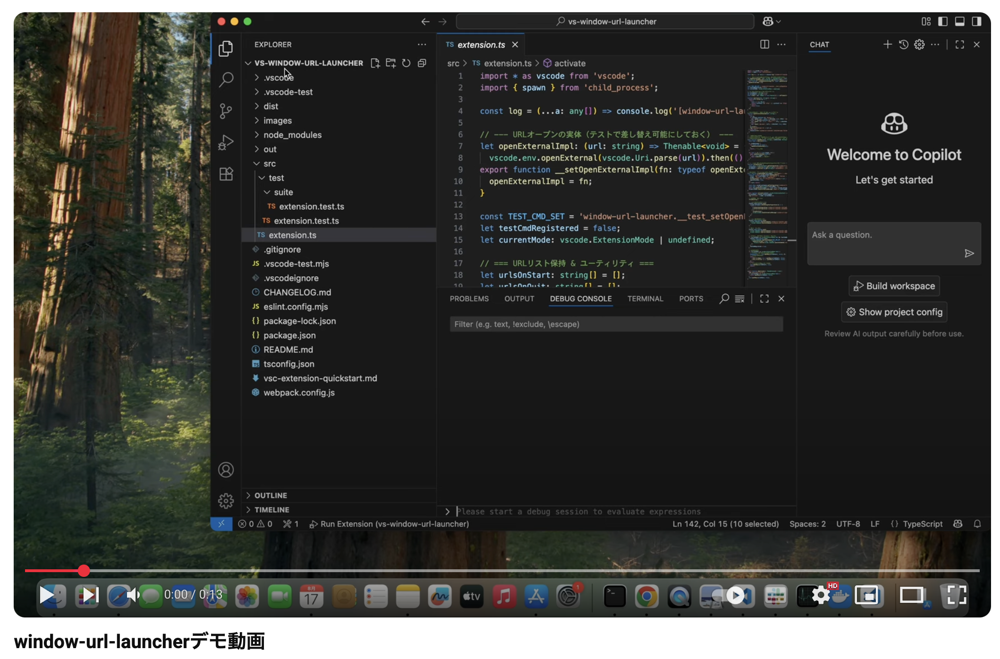

# window-url-launcher

## 🚀 概要

VS Code 起動時／終了時に、指定の Web サイトをブラウザで開く。

## ⚙️ 設定項目

**コマンドパレット** から操作

- **Mac:** `Shift + Cmd + P`  
- **Windows/Linux:** `Shift + Ctrl + P`  

コマンド一覧：

- `window-url-launcher: Open Settings` – 設定画面を開く
- `window-url-launcher: Add Startup URL` – 起動時 URL を追加  
- `window-url-launcher: Add Shutdown URL` – 終了時 URL を追加  

## 📸 動作確認

